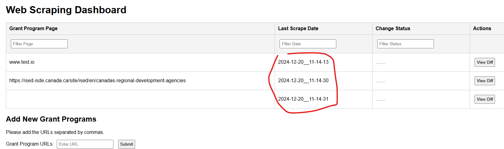

## HOW-TO run on your local PC

1.  start redis with `podman run --name my-redis -d -p 6379:6379 -v ./redis_celery_artifacts/redis_data:/data redis`

    > Please create `./redis_celery_artifacts/redis_data/` and `./redis_celery_artifacts/celerybeat_schedule/` folder structure by hand.

    > By default, data in the Redis container is ephemeral. To persist data, mount a volume to the container's /data directory.

    > For Ubuntu, start redis this way:

    > (base) da_user2@lambda-dual:~/Documents/Iteration1_changeMonitor$ sudo systemctl start redis

    > (base) da_user2@lambda-dual:~/Documents/Iteration1_changeMonitor$ sudo systemctl status redis

         ● redis-server.service - Advanced key-value store
         Loaded: loaded (/lib/systemd/system/redis-server.service; enabled; vendor preset: enabled)
         Active: active (running) since Tue 2025-02-11 15:13:32 EST; 22min ago
         Docs: http://redis.io/documentation,
         man:redis-server(1)
         Main PID: 9023 (redis-server)
         Tasks: 4 (limit: 308978)
         Memory: 5.5M
         CGroup: /system.slice/redis-server.service
         └─9023 /usr/bin/redis-server 127.0.0.1:6379

         Feb 11 15:13:32 lambda-dual systemd[1]: Starting Advanced key-value store...
         Feb 11 15:13:32 lambda-dual systemd[1]: redis-server.service: Can't open PID file /run/redis/redis-se>
         Feb 11 15:13:32 lambda-dual systemd[1]: Started Advanced key-value store.

    > (base) da_user2@lambda-dual:~/Documents/Iteration1_changeMonitor$

1.  start celery worker with `celery -A celery_app worker --loglevel=info -P solo`
    > Note we set `-P solo` for Windows, we don't need to for Linux & MacOS
1.  in a separate terminal, run `celery -A celery_app beat --loglevel=info` to start beat scheduler, so that the tasks get executed at given intervals.

1.  This is the result:

    - Terminal 1:

    ```
    C:\Users\lizhou\Documents\4_Clean_Growth_Hub_webscraping\Iteration1_changeMonitor (main -> origin)
    (cgh) λ celery -A celery_app beat --loglevel=info
    celery beat v5.4.0 (opalescent) is starting.
    ...
    ...
    ...
    [2024-12-20 11:12:14,807: INFO/MainProcess] beat: Starting...
    [2024-12-20 11:13:02,029: INFO/MainProcess] Scheduler: Sending due task run-my-script (celery_tasks.run_my_script)
    [2024-12-20 11:14:00,000: INFO/MainProcess] Scheduler: Sending due task run-my-script (celery_tasks.run_my_script)
    ```

    the last two lines means beat scheduler sent the task to run by celery worker

    - Terminal 2:

    ```
    C:\Users\lizhou\Documents\4_Clean_Growth_Hub_webscraping\Iteration1_changeMonitor (main -> origin)
    ...
    ...
    ...
    [2024-12-20 11:12:22,272: INFO/MainProcess] celery@L-BSC-A149822 ready.
    [2024-12-20 11:13:06,132: INFO/MainProcess] Task celery_tasks.run_my_script[73cabad9-810c-475e-97f2-18a607f57ece] received
    [2024-12-20 11:13:06,133: WARNING/MainProcess] Automatic Scraping Starts!!!!!!!!!!!!!
    ...
    ...
    [2024-12-20 11:13:43,781: WARNING/MainProcess] Automatic Scraping Ends!!!!!!!!!!!!!
    [2024-12-20 11:13:45,833: INFO/MainProcess] Task celery_tasks.run_my_script[73cabad9-810c-475e-97f2-18a607f57ece] succeeded in 39.70299999999952s: None
    [2024-12-20 11:14:00,005: INFO/MainProcess] Task celery_tasks.run_my_script[0e24adc7-fa98-4b6a-b364-d339ef90d687] received
    [2024-12-20 11:14:00,007: WARNING/MainProcess] Automatic Scraping Starts!!!!!!!!!!!!!
    ...
    ...
    [2024-12-20 11:14:31,404: WARNING/MainProcess] Automatic Scraping Ends!!!!!!!!!!!!!
    [2024-12-20 11:14:31,407: INFO/MainProcess] Task celery_tasks.run_my_script[0e24adc7-fa98-4b6a-b364-d339ef90d687] succeeded in 31.40599999999904s: None
    ```

1.  If you open up the UI by running `uvicorn app:app --reload`, we can see the latest scraping happened at `11: 14` AM, 2024-12-20, the exact datetime this example ran.

    

1.  Directory structure

    ```
    /project_root/
    ├── Dockerfile
    ├── docker-compose.yml
    ├── requirements.txt
    ├── celery_app.py
    ├── celery_tasks.py
    ├── app.py
    ├── templates/
        └── ...
    ├── static/
        └── ...
    ├── imgs/
        └── ...
    ├── utils/
    │   └── (other Python modules)
    └── redis_celery_artifacts/
       ├── celerybeat_schedule/
       └── redis_data/

    ```

### IMPROVEMENTS

1. colorized diff (DONE)
1. add loading/waiting for response buffer symbol (DONE, but remember to clear cache to function well)
1. each URL only occupies one row, new scraping will overwrite old scraping of the same URL (DONE).
1. button to rescrape each row/URL individually (DONE)
1. button to scrape entire table (all rows/URLs) (DONE)
1. dynamically adjust input box size with content (DONE)
1. remove config messages that are only called once (DONE)
1. sync local SQLite db with Git repo, by just removing the rows from SQLite where the URLs don't exist in the remote Git repo (DONE)
1. Sort by last scrape datetime (DONE)
1. `Change Status` col labels when there is an actual diff (DONE)
1. Why is grants.db not committed to repo (DONE)
1. Don't use SQLite, but use Pandas DataFrame and CSV to store data(DONE)
1. ONLY commit when there is an actual content change from given URL. (DONE)
1. Last Scrape DateTime sort arrow does not work(DONE)
1. I put in somethin that's not a url, it didn't get added, but there was no info to me about it being an invalid input (DONE)
1. Use the same algo as Ctrl+F to search for duplicate rows in name_registry file.(N/A)
1. refactor JS code (DONE)
1. Scraping is very slow!!!!!! (Use BS4 then Selenium as fall back if BS4 fails)
1. We cannot connect to Gmail server to send emails to users when using VPN/internal (out of scope).
1. All scraping time should be Ottawa time !!!(DONE)
1. Send an email to designated/customizable address (DONE)
1. Mark as reviewed/done (DONE)
1. delete row(DONE); Include a button/checkbox to delete/remove a URL
1. Collapse the rows without change(DONE)

1. Highlight the datetimes
1. Add a button to generate an email to a drop-down list of names
1. Please add a count at the top - how many sites were scraped in total, how many flagged as changes in total, how many flagged as significant changes in total?

1. Show in the changes which ones are related to the keywords; Could keywords/semantic phrases be highlighted in a specific colour (in the "show diff" results)?
1. How to do serverless locally?
1. group into organizations, so, open or collapse all the URLs related to a specific org.
1. I tried adding a url thats already in the list again (and also pasted it a few times with commas so like 4 times in the same submission) - it worked but maybe there could be a check to see if a url is already on there? to let the user know?
1. I put in urls separated by a semi-colon - didn't work but no info to me
1. date filter would be easier to use if it had a datepicker?
1. When merge comflicts, REBASE!!!!!!
1. Allow viewing the complete history, not just the most recent diffs.
1. Optimize: have the git remote updated only when all scrape is done!
1. input boxes to modify the scheduled time for aut-scraping
1. button to start/stop scheduled auto-scraping
1. Recommendation engine,
1. Group the URLs by dept, display names instead of the exact URLs
1. In the URL input box, add support for enter instead of hitting submit
1. Include a button/checkbox to hide or show (expand or collapse) a result
1. Could we choose to apply the keywords list, and not apply it, by clicking a button/selecting a checkbox?
1. can we have the ability to edit a URL?

## NOTES:

1. The thing with the list of keywords is that there is no context with each word. Your training examples will have the proper context for the model to learn from.

1. The SQLite db is committed at different time as the files storing URL contents, therefore, if we use `git show #hash`, the URL content diffs will show up at different commits from the SQLite commits.

   ```
   C:\Users\lizhou\Documents\4_Clean_Growth_Hub_webscraping\Iteration1_changeMonitor\webpage_tracking_repo (master)
   (test) λ git diff HEAD~5 HEAD~4
   diff --git a/2025-01-10__13-33-53_c00dca.txt b/2025-01-10__13-33-53_c00dca.txt
   index 150e046..261d9c0 100644
   --- a/2025-01-10__13-33-53_c00dca.txt
   +++ b/2025-01-10__13-33-53_c00dca.txt
   @@ -5,8 +5,7 @@ Sign in
   Google offered in: Français
   Canada
   Advertising
   -Business
   -How Search works
   +Businesh works
   Privacy
   Terms
   -Settings
   \ No newline at end of file
   +Settings

   C:\Users\lizhou\Documents\4_Clean_Growth_Hub_webscraping\Iteration1_changeMonitor\webpage_tracking_repo (master)
   (test) λ git diff HEAD~6 HEAD~5
   diff --git a/grants.db b/grants.db
   index d389870..9be70cd 100644
   Binary files a/grants.db and b/grants.db differ
   ```

1. SQLite content rendering

- Storing the formatted diff in `SQLite`: When the `colorize_diff` function processes the diff, it generates a string with HTML tags (e.g., `<span style='color: green;'>`). This string is written directly to the database.
- Rendering the stored diff: When retrieving the diff from SQLite to display in the HTML table, the tags are displayed as raw text because they are not interpreted as HTML.
- The simplest fix is to ensure that the diff content is rendered as HTML in your table. Use the safe filter in Jinja2 templates when rendering the diff:

  ```
  <tr class="diff-row" style="display:none;">
     <td colspan="4">{{ grant.diff | safe }}</td>
  </tr>
  ```

1. The spinner animation for loading/waiting for scraping to be done may not work for Chrome (UNKNOWN reason), try use Chrome Incognito.

   - it turned out that we need to clear browser cache to have the app working properly.

1. for nested URLs, these two are testing URLs: `https://ised-isde.canada.ca/site/ised/en/canadas-regional-development-agencies` and `https://www.ngen.ca/funding`
